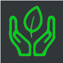

<h1 align="center">UnTrashed🌍♻️</h1>

    

UnTrashed is a gamified app making cleanup fun! Users can spot, tag, and dispose of litter, earning points, achieving goals, and contributing to a cleaner world. 🌎✨

### Overview 🎯

UnTrashed combines real-world impact with the thrill of a game. Using computer vision, users tag trash, confirm disposal, and score points based on trash type.

### How it Works 🚮➡️📱

- Tagging Trash: See litter? Tag it in the app to mark it for disposal.
- Resolve & Verify: Dispose the tagged item and snap a pic to confirm it's in a bin.
- Anti-Scam Detection: Our computer vision tech verifies the match – no shortcuts! 🔍
- Earn Rewards: Correct matches = points + confetti! 🎉
- Events & Trashure Hunts 🎈

Join local cleanup events like “Make Merano Clean Again” and earn double points!
Invite friends and compete in Trashure Hunts for extra rewards.

### More Features 🌟

🏆 Leaderboard: Compete for the top spot.
📊 User Stats: Track your impact with detailed stats.
Let’s clean up, one tag at a time! 🧹🌱
